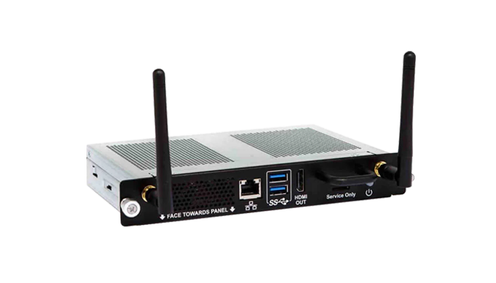
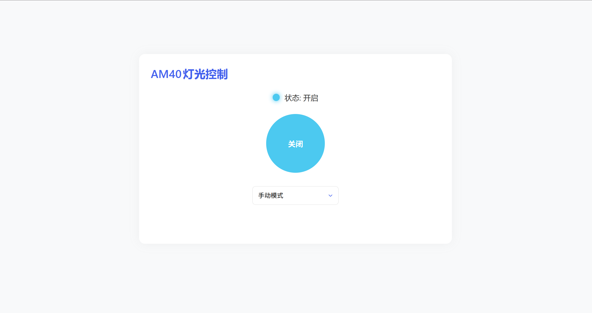

# AM40-LED-Control
<br/>
<br/>
<p align="center">
    
</p>

<h3 align="center">AM40-LED-Control</h3>
<p align="center">
    快捷控制 SMART AM40 设备电源灯光的 Web 程序
</p>

## 系统要求

本程序已在 Armbian_23.02.2_am40_jammy_current_6.1.11.img 系统镜像上通过测试 其他 Linux 系统还未做测试 可自行尝试安装

<p align="center">
    
</p>



## 安装步骤

### 1. 下载安装包到临时目录
```bash
curl -o /tmp/am40-led-control.tar https://github.com/zhunse/AM40-LED-Control/releases/download/V1.0/am40-led-control.tar
```

### 2. 解压安装包
```bash
tar -xvf /tmp/am40-led-control.tar -C /tmp/
```
### 3. 进入解压目录
```bash
cd /tmp/am40-led-control
```

### 4. 添加执行权限
```bash
chmod +x install.sh
```

### 5. 运行安装脚本（需要root权限）
```bash
sudo ./install.sh
```
### 6. 安装完成后可删除临时文件（可选）
```bash
rm -rf /tmp/am40-led-control*
```

### 补充说明

#### 为什么做这个程序？

设计的初衷是因为晚上睡觉时灯光非常刺眼睛有点影响睡眠 但是里面部署了 Home Assistant 青龙面板 等系列服务，所以一般没有关机，虽然说可以通过一些指令来控制它的灯光但是 我都已经躺在床上了还去敲什么代码。所以就干脆直接做了一个程序比较方便来控制灯光。

#### 服务管理

程序安装完成后可在终端里面通过 `led-control` 指令进行管理

```bash
led-control status      # 查看状态
led-control start       # 启动服务
led-control stop        # 停止服务
led-control restart     # 重启服务
led-control enable      # 启用开机自启
led-control disable     # 禁用开机自启
led-control set-port    # 修改服务端口
led-control uninstall   # 卸载服务
led-control help        # 显示帮助
```
#### 控制页面

灯光开关面板可在浏览器中输入以下URL进行访问

 `（以下是默认情况下的端口号 如无法访问可在系统防火墙里放行端口 不排除安装中使用其他端口号的可能）`

```url
http://<设备IP>:5000
```

### 打赏作者


